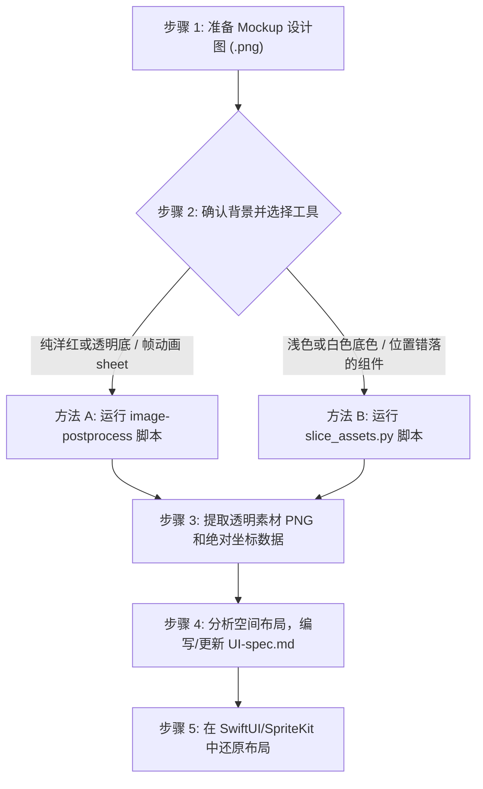

# 从设计图/Mockup 到 UI-Spec 的完整工作流指南

本指南定义并固化了**从 AI 生成设计图/Mockup 切图**到**产出 UI 布局规范 (UI-Spec.md)** 的标准流程。此流程旨在确保后续其他 UI 页面的切图提取与还原的高精度与稳定性。

---

## 1. 完整工作流说明

从一张 Mockup 设计图到最终实现 UI 代码，标准步骤如下：



### 步骤 1：准备 Mockup 设计图
确认输入图片的尺寸（例如 `608 × 1280`）。所有的相对边距、按钮尺寸都将以该分辨率为基准。

### 步骤 2：选择切图脚本
根据 Mockup 图片的底色和排布，选择最适合的提取工具（详见下文工具对比）。

### 步骤 3：提取透明素材与坐标
运行对应的 Python 脚本。脚本会自动完成背景过滤（转为透明）与独立元素切分，并计算出每个元素在原图中的绝对坐标。

### 步骤 4：整理生成 UI-spec.md
基于切图导出的尺寸与坐标数据，提取关键的布局常数：
* **对齐边距 (Margin)**：如 `left_margin = x1`，`right_margin = Canvas_Width - x2`。
* **元素间距 (Spacing)**：如 `vertical_spacing = y1_below - y2_above`。
* **锚点类型 (Anchor)**：决定该组件在屏幕拉伸时是靠左、靠右、靠上还是居中。

---

## 2. 切图工具对比与差别说明

项目中存在两套处理脚本，请根据不同 Mockup 图像特征进行选择：

| 维度 | 内置 `image-postprocess` 脚本 | 特化 `slice_assets.py` 脚本 |
| :--- | :--- | :--- |
| **适用背景类型** | 纯洋红色 (`#FF00FF`) 背景 或 透明背景 | 纯白、浅灰色等浅色不透明底色背景 |
| **元素分割机制** | **投影波谷分析 (Projection)**：<br>通过检测图像在水平与垂直方向上的空白通道线来切分网格。 | **8-邻接连通域 (Connected Component Labeling)**：<br>通过广度优先遍历追踪透明像素环绕的物理连通实体。 |
| **局限性** | 如果多个元素水平或垂直对齐（如同列的一组按钮），且其间没有贯穿整张大图的空白线，则它们会被粘连成一个长条（无法切开）。 | 若单个 UI 元素本身包含物理上完全断开的透明悬空部分，可能会被识别为两个子元素。 |
| **坐标输出** | 会对大图进行 `trim` 裁剪消除边缘多余空间，输出的坐标是裁剪后的**相对偏移坐标**。 | 不裁剪大图，输出的是完全对应设计图的**绝对真实坐标**，利于在代码中无偏移还原。 |
| **主要应用场景** | 帧动画序列帧、按规则格子排列的素材图。 | 整版 UI 界面 Mockup 设计稿、多按钮位置错落有致的非网格排版大图。 |

---

## 3. 切图脚本实操指令

### 方法 A：使用 `image-postprocess` 脚本 (适用于洋红底/网格)
若您的 Mockup 素材背景是标准的洋红色 (#FF00FF)，可直接使用系统提供的后处理工具：
```bash
python3 ~/.cursor/skills/image-postprocess/scripts/floodfill_remove_bg.py \
  art/your_magenta_mockup.png \
  --slice \
  --output-dir art/spec \
  --max-size 0
```
*(注意：`--max-size 0` 用于保留原始分辨率，防止素材被等比缩小。)*

### 方法 B：使用 `slice_assets.py` 脚本 (适用于白底/错落排版)
若您的 Mockup 是带有白色或淡白色底的界面设计大图，应使用特化的连通域分析脚本：
```bash
python3 art/slice_assets.py \
  -i art/asset_all_fal.png \
  -o art/spec \
  -t 245 \
  --game-layout
```
*(参数说明：`-t` 为浅色背景过滤阈值，若底色偏灰可以调低至 `240`；`--game-layout` 会根据坐标位置自动对 ScrewEveryday 的金币条、体力条、各按钮完成标准重命名。)*

---

## 4. 如何生成与编写 UI-spec.md

切图运行完成后，以 `layout_report.txt` 中的数据为基础，编写 UI 规范文件：

### 4.1 空间距离公式参考
* **元素宽度**：$W = x_2 - x_1 + 1$
* **元素高度**：$H = y_2 - y_1 + 1$
* **靠左外边距**：$MarginLeft = x_1$
* **靠右外边距**：$MarginRight = CanvasWidth - x_2$
* **两垂直相邻元素间距**：$Spacing = y_{1\_below} - y_{2\_above}$

### 4.2 UI-spec.md 推荐大纲模版
在为新界面产出规范时，需包含以下核心板块（可参考 [art/spec/UI-spec.md](file:///Users/yd-sz-dn0588/Downloads/game/ScrewEverydaySpriteKit/art/spec/UI-spec.md)）：
1. **全局画布规格**：声明设计图的基础分辨率和比例（如 608x1280）。
2. **锚点布局关系图**：使用 Mermaid 流程图绘制出元素相对于屏幕边界的锚定依附关系。
3. **坐标数据明细表**：列出每个素材文件名、绝对坐标范围、宽高、以及对应的代码中逻辑锚点。
4. **间距深度分析**：归纳各个组件群组（如悬浮列、状态栏）内部的相对排版间距常数。
5. **响应式适配建议**：给出当屏幕宽高比变宽（iPad）或变长（新版手机）时，UI 应该如何推开或缩放的逻辑建议。
