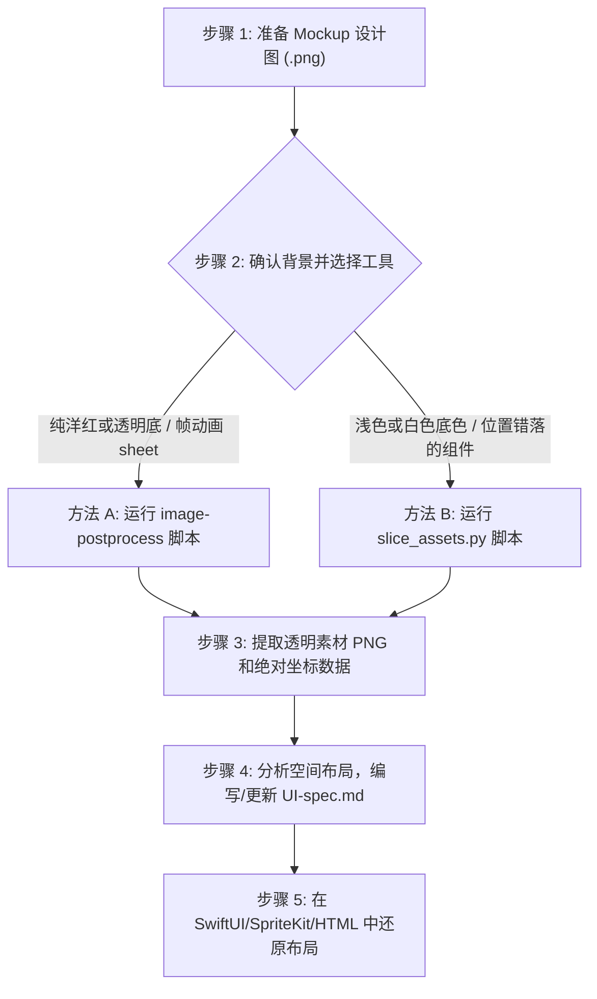

# 从设计图/Mockup 到 UI-Spec 的完整工作流指南 (mockup2spec_workflow)

本指南定义并固化了**从 AI 生成设计图/Mockup 切图**到**产出 UI 布局规范 (UI-Spec.md)** 的标准流程。此流程旨在确保后续其他 UI 页面的切图提取与还原的高精度与稳定性。

---

## 1. 完整工作流说明

从一张 Mockup 设计图到最终实现 UI 代码，标准步骤如下：



### 步骤 1：准备 Mockup 设计图
确认输入图片的尺寸（例如 `608 × 1280`）。所有的相对边距、按钮尺寸都将以该分辨率为基准。

### 步骤 2：选择切图脚本
根据 Mockup 图片的底色和排布，选择最适合的提取工具（详见下文工具对比）。

### 步骤 3：提取透明素材与坐标
运行对应的 Python 脚本。脚本会自动完成背景过滤（转为透明）与独立元素切分，并计算出每个元素在原图中的绝对坐标。

### 步骤 4：整理生成 UI-spec.md
基于切图导出的尺寸与坐标数据，提取关键的布局常数：
* **对齐边距 (Margin)**：如 `left_margin = x1`，`right_margin = Canvas_Width - x2`。
* **元素间距 (Spacing)**：如 `vertical_spacing = y1_below - y2_above`。
* **锚点类型 (Anchor)**：决定该组件在屏幕拉伸时是靠左、靠右、靠上还是居中。

---

## 2. 切图工具对比与差别说明

项目中存在两套处理脚本，请根据不同 Mockup 图像特征进行选择：

| 维度 | 内置 `image-postprocess` 脚本 | 特化 `slice_assets.py` 脚本 |
| :--- | :--- | :--- |
| **适用背景类型** | 纯洋红色 (`#FF00FF`) 背景 或 透明背景 | 纯白、浅灰色等浅色不透明底色背景 |
| **元素分割机制** | **投影波谷分析 (Projection)**：<br>通过检测图像在水平与垂直方向上的空白通道线来切分网格。 | **8-邻接连通域 (Connected Component Labeling)**：<br>通过广度优先遍历追踪透明像素环绕的物理连通实体。 |
| **局限性** | 如果多个元素水平或垂直对齐（如同列的一组按钮），且其间没有贯穿整张大图的空白线，则它们会被粘连成一个长条（无法切开）。 | 若单个 UI 元素本身包含物理上完全断开的透明悬空部分，可能会被识别为两个子元素。 |
| **坐标输出** | 会对大图进行 `trim` 裁剪消除边缘多余空间，输出的坐标是裁剪后的**相对偏移坐标**。 | 不裁剪大图，输出的是完全对应设计图的**绝对真实坐标**，利于在代码中无偏移还原。 |
| **主要应用场景** | 帧动画序列帧、按规则格子排列的素材图。 | 整版 UI 界面 Mockup 设计稿、多按钮位置错落有致的非网格排版大图。 |

---

## 3. 切图脚本实操指令

### 方法 A：使用 `image-postprocess` 脚本 (适用于洋红底/网格)
若您的 Mockup 素材背景是标准的洋红色 (#FF00FF)，可直接使用系统提供的后处理工具：
```bash
python3 ~/.cursor/skills/image-postprocess/scripts/floodfill_remove_bg.py \
  art/your_magenta_mockup.png \
  --slice \
  --output-dir art/spec \
  --max-size 0
```
*(注意：`--max-size 0` 用于保留原始分辨率，防止素材被等比缩小。)*

### 方法 B：使用 `slice_assets.py` 脚本 (适用于白底/错落排版)
若您的 Mockup 是带有白色或淡白色底的界面设计大图，应使用特化的连通域分析脚本：
```bash
python3 art/slice_assets.py \
  -i art/asset_all_fal.png \
  -o art/spec \
  -t 245 \
  --game-layout
```
*(参数说明：`-t` 为浅色背景过滤阈值，若底色偏灰可以调低至 `240`；`--game-layout` 会根据坐标位置自动对 ScrewEveryday 的金币条、体力条、各按钮完成标准重命名。)*
---


## 4. 如何在源头上避免毛刺的产生

虽然特化后处理脚本能通过羽化和边缘膨胀去白边，但最彻底的方式是在**美术资源生成与导出阶段控制源头**，从根本上杜绝毛刺和白边：

### 4.1 AI 绘图生成阶段（从提示词和背景锁控制）
* **锁定纯色洋红或亮绿绿幕背景**：
  在生成单个或整套 UI 元素大图时，提示词尾部应强制加上：
  `on a solid magenta (#FF00FF) background` 或者是 `on a solid lime green (#00FF00) background`。
  * *原因*：UI 按钮和边框很少使用纯洋红或亮绿色，这种互补色在抠图时有极大的色差判定空间，使用 `floodfill_remove_bg.py --bg global` 可以做到 100% 抠净且不留任何溢色。
### 4.2 美术设计阴影处理 (AI 绘图控制)
虽然是在 AI 绘图阶段，但强烈建议在提示词中加入 `no shadows, flat 2d asset, sharp outline`，防止 AI 自动在按钮边缘生成向白色背景扩散的软阴影或渐变高光。这些复杂的半透明过渡像素与白底混合后在抠图时极难还原，阴影应通过 iOS 层的 `.shadow()` 或前端的 `filter: drop-shadow()` 来动态渲染。


---

## 5. 如何生成与编写 UI-spec.md

切图运行完成后，以 `layout_report.txt` 中的数据为基础，编写 UI 规范文件：

### 5.1 空间距离公式参考
* **元素宽度**：$W = x_2 - x_1 + 1$
* **元素高度**：$H = y_2 - y_1 + 1$
* **靠左外边距**：$MarginLeft = x_1$
* **靠右外边距**：$MarginRight = CanvasWidth - x_2$
* **两垂直相邻元素间距**：$Spacing = y_{1\_below} - y_{2\_above}$

### 5.2 UI-spec.md 推荐大纲模版
在为新界面产出规范时，需包含以下核心板块（可参考 [art/spec/UI-spec.md](file:///Users/yd-sz-dn0588/Downloads/game/ScrewEverydaySpriteKit/art/spec/UI-spec.md)）：
1. **全局画布规格**：声明设计图的基础分辨率和比例（如 608x1280）。
2. **锚点布局关系图**：使用 Mermaid 流程图绘制出元素相对于屏幕边界的锚定依附关系。
3. **坐标数据明细表**：列出每个素材文件名、绝对坐标范围、宽高、以及对应的代码中逻辑锚点。
4. **间距深度分析**：归纳各个组件群组（如悬浮列、状态栏）内部的相对排版间距常数。
5. **响应式适配建议**：给出当屏幕宽高比变宽（iPad）或变长时，UI 应该如何推开或缩放的逻辑建议。

---

## 6. 从 UI-Spec 到代码的还原流程与注意事项

在拿到 UI-Spec 坐标规格数据后，将其翻译为 Swift/SwiftUI/SpriteKit 或者是 HTML 代码时，需要特别遵守以下开发还原流程与注意事项：

### 6.1 绝对坐标向代码的映射步骤
1. **定义设计稿常量**：在代码基类或布局管理器中声明原始设计稿宽度和高度常量（如 `let DesignWidth: CGFloat = 608`，`let DesignHeight: CGFloat = 1280`）。
2. **计算屏幕缩放因子**：根据当前设备物理屏幕大小计算等比缩放比率：
   * SwiftUI/HTML: `scale = CurrentScreenWidth / DesignWidth`
   * 在布局时，所有绝对像素的尺寸和间距都乘以该缩放比率。
3. **应用锚点相对定位**：不要将所有元素都用 `left/top` 绝对写死。状态栏元素需采用相对于屏幕顶部的偏移，底部 `PLAY` 按钮采用相对于屏幕底部的相对偏移。

### 6.2 关键注意事项

#### ⚠️ 注意事项 A：Y 轴方向反转与中心点偏移 (SpriteKit 专属)
* **坐标系差异**：设计稿与 HTML 的 Y 轴**向下递增**（原点在左上角），而 iOS 的 SpriteKit 的 Y 轴**向上递增**（原点在左下角）。
* **中心点锚点 (Anchor Point) 偏移**：SpriteKit 默认的节点位置 `position` 是节点本身的中心点 `(0.5, 0.5)`，而设计稿的绝对 $y_1$ 指的是元素左上角。
* **位置转换公式**：
  若已知设计稿上的元素左上角坐标为 $(x_1, y_1)$，元素宽度为 $W$，高度为 $H$，画布设计总高为 $CanvasHeight$，则在 SpriteKit 中设置其位置的正确公式为：
  $$X_{SpriteKit} = x_1 + W / 2$$
  $$Y_{SpriteKit} = CanvasHeight - y_1 - H / 2$$

#### ⚠️ 注意事项 B：层级管理 (`zPosition`) 与触摸穿透
* 元素叠加（背景图、按钮、文字标签）时，必须在代码中**显式且严密地定义 `zPosition` 的大小**（如背景设为 0，交互按钮设为 10，弹出模态框设为 100）。
* 避免由于层级混乱导致交互按钮被隐式透明的背景图遮挡，产生“按钮可见但无法点击”的触摸屏蔽现象。

#### ⚠️ 注意事项 C：连续点击与动画锁 (`isBusy`)
* 在游戏还原中，很多按钮点击后会触发转场或飞行动画。在点击事件触发时，**必须第一时间在全局增加 `isBusy` 动画状态锁**，阻止用户在动画进行期间重复点击按钮，从而避免触发多次业务请求或破坏 UI 状态堆栈。

#### ⚠️ 注意事项 D：SwiftUI 与 SpriteKit 的状态解耦
* 在 SwiftUI 混合 SpriteKit 的架构中，尽量**不要**跨引擎直接绑定 `@State`。应当通过闭包回调（Callback Closures）触发视图逻辑，让 SpriteKit 专注于物理与交互渲染，SwiftUI 专注于页面外围容器，以此保持高度的松耦合。

