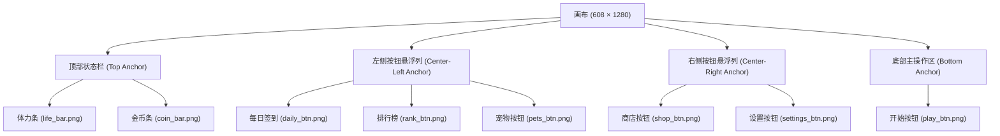

# 游戏主界面 UI 空间布局规范 (UI-spec)

本文档定义了根据 `art/asset_all_fal.png` 提取的 UI 元素的空间布局规范。所有坐标与尺寸均基于原始设计稿分辨率 **608 × 1280**。

---

## 1. 全局画布规格

* **设计分辨率**：608 × 1280 像素 (宽 × 高)
* **屏幕宽高比**：1 : 2.1 (适合全面屏手机进行等比缩放或锚点适配)
* **坐标系说明**：以左上角为原点 `(0, 0)`，X 轴向右递增，Y 轴向下递增。

---

## 2. UI 整体结构与锚点分布

---

## 3. UI 元素空间数据明细

本数据采用**边缘去毛刺羽化**与**实体物理 Bounding Box 收拢分析**测出，消除了由于背景抗锯齿发白导致的外接矩形向外膨胀：

| 元素名称 | 文件名 | 尺寸 (宽×高) | 精确绝对坐标 (x1, y1) 到 (x2, y2) | 锚点类型 | 核心布局边距/间距 |
| :--- | :--- | :--- | :--- | :--- | :--- |
| **体力条** | `life_bar.png` | 178 × 63 | `(18, 25)` 到 `(195, 87)` | 左上锚定 (Top-Left) | 距左边缘 `18px`，距顶边缘 `25px` |
| **金币条** | `coin_bar.png` | 166 × 60 | `(428, 28)` 到 `(593, 87)` | 右上锚定 (Top-Right) | 距右边缘 `15px`，距顶边缘 `28px`，底部与体力条对齐 |
| **每日签到** | `daily_btn.png` | 89 × 114 | `(16, 647)` 到 `(104, 760)` | 中左锚定 (Center-Left) | 距左边缘 `16px` |
| **排行榜** | `rank_btn.png` | 89 × 110 | `(16, 773)` 到 `(104, 882)` | 中左锚定 (Center-Left) | 距左边缘 `16px`，与 Daily 间距 `13px` |
| **宠物按钮** | `pets_btn.png` | 89 × 109 | `(16, 898)` 到 `(104, 1006)` | 中左锚定 (Center-Left) | 距左边缘 `16px`，与 Rank 间距 `16px` |
| **商店按钮** | `shop_btn.png` | 88 × 114 | `(505, 806)` 到 `(592, 919)` | 中右锚定 (Center-Right) | 距右边缘 `16px` |
| **设置按钮** | `settings_btn.png` | 88 × 116 | `(505, 931)` 到 `(592, 1046)` | 中右锚定 (Center-Right) | 距右边缘 `16px`，与 Shop 间距 `12px` |
| **开始游戏** | `play_btn.png` | 325 × 150 | `(142, 1048)` 到 `(466, 1197)` | 底部居中 (Bottom-Center) | 完美水平居中 (左右距边均为 `142px`)，距底边缘 `83px` |

---

## 4. 间距与相对位置深度分析

### 4.1 顶部状态区 (Top-Status Bar)
* **对齐特征**：体力条底部 $y = 87$，金币条底部 $y = 87$。在设计稿中，两状态条的底部在一条水平线上，呈完全对齐状态。
* **水平分布**：
  * 左侧体力条与右侧金币条之间的视觉间距：`428 - 195 = 233px`。

### 4.2 悬浮按钮组 (Floating Button Groups)
* **左侧悬浮列**（Daily, Rank, Pets）：
  * 位于主界面的左中下部。
  * 总高度范围：`y = 647` 到 `y = 1006`，总跨度 `359px`。
  * 三个按钮的左外边缘在 X 轴完全对齐（均为 `16px` margin-left），垂直间距为 `13px` 与 `16px`。
* **右侧悬浮列**（Shop, Settings）：
  * 位于主界面的右中下部。
  * 总高度范围：`y = 806` 到 `y = 1046`，总跨度 `240px`。
  * 按钮的右外边缘在 X 轴完全对齐（距右边缘均为 `16px`），垂直间距为 `12px`。

### 4.3 底部交互区 (Bottom Action Area)
* **开始游戏按钮** (Play Button) 垂直高度为 `1048` 到 `1197`。其顶部高度 $y = 1048$ 刚好承接在右侧设置按钮底部 $y = 1046$ 的正下方，形成了紧密的阶梯式排布，在保证交互热区的前提下最大化利用了屏幕高度空间。

---

## 5. 多屏幕适配建议 (Responsive Adaptive Policy)

1. **顶部元素 (life_bar & coin_bar)**：
   * 采用锚定在屏幕安全区域 (Safe Area) 的顶部左右两侧。在更宽的屏幕 (如 iPad) 上，它们会分别往两侧推，中间间距增大。
2. **悬浮元素 (左侧三按钮 & 右侧两按钮)**：
   * 锚定于屏幕安全区域的左边缘与右边缘。
   * Y 轴方向上，建议在垂直方向上根据屏幕比例等比缩放或以底部开始按钮为基准向上定位，以确保在大屏或小屏手机上不会与底部的 `PLAY` 按钮重叠。
3. **开始按钮**：
   * 采用水平居中，并保持相对于屏幕安全区域底部的底边距 (`83px` 对应设计稿比例，或约占屏幕总高度的 `6.5%`) 进行锚定。
