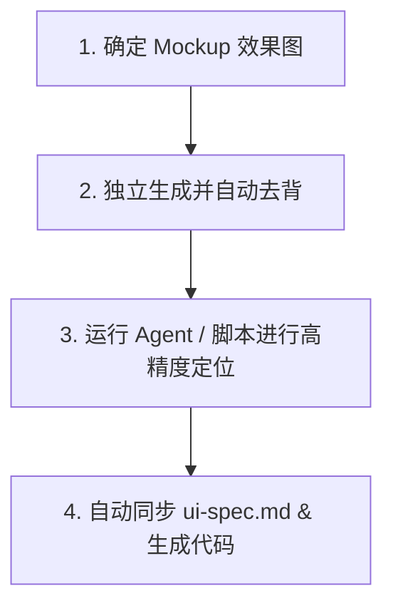

# 首页从 Mockup 直达 SwiftUI 代码的标准自动化工作流

本文档定义了如何从一张 AI 生成的首页 Mockup 效果图出发，在保证按钮美术质感图片表现的前提下，实现**去背切图、高精度自动匹配定位、自动同步 Spec、直接生成 SwiftUI 代码**的标准自动化流水线。

---

## ⚙️ 核心流程 (4步法)



### 1. 确定 Mockup 效果图与图层识别
- AI 生成一张包含所有按钮和背景的完整 Mockup 效果图，确定整体的美术品质与布局风格。
- 将原图存入 `art/` 目录，例如 `art/mockup_industrial_mech.png`。
- **关键子步骤：图层拆解识别**。在进入下一步前，必须对照 Mockup 大图列出**图层拆解清单**，并在 `art/slicing/layers.manifest.json` 中注册它们的草稿信息：
  1. **背景底图层** (`background`)：完全不含任何文字、按钮、浮动元素的干净场景底图。
  2. **主视觉与装饰层** (`decor`)：如标题 Logo、背景中巨大的 3D 齿轮、辅助小角色等。它们不需要响应交互，但需要作为独立图层贴在背景上，以方便代码控制它们播放淡入、漂浮等氛围动效。
  3. **交互控件层** (`button` / `control`)：如“开始游戏”按钮、“设置”齿轮、“商店”入口等。**这些必须在下一步中作为独立素材独立生成**，确保美术细节拉满且便于绑定事件。

### 2. 独立生成并自动去背
- 根据 Mockup 风格，使用 AI **分别生成**：
  1. **纯净背景图** (不包含任何按钮和文字，可利用 AI 局部重绘-Inpaint 擦除)。
  2. **带洋红背景的独立按钮素材** (在 Prompt 结尾加 `on a solid magenta (#FF00FF) background`)。
- 将洋红底按钮图片放入 `art/slicing/assets/` 目录下。
- 运行去背脚本（自动将洋红底去除，输出高精度 Alpha 透明通道的 PNG 按钮）：
  ```bash
  python3 ~/.cursor/skills/image-postprocess/scripts/floodfill_remove_bg.py \
    --bg flood \
    --input art/slicing/assets/raw_button.png \
    --output art/slicing/assets/start_button.png
  ```

### 3. 运行脚本进行 Alpha Mask 遮罩定位
- 在 `art/slicing/layers.manifest.json` 中定义好模板路径与待定位的按钮 ID。
- 运行定位匹配脚本：
  ```bash
  python3 tools/yueban-image-to-code/scripts/locate_assets.py \
    art/mockup_industrial_mech.png \
    art/slicing/layers.manifest.json
  ```
  > [!TIP]
  > 该脚本已升级为 **Alpha-Masked NCC 匹配算法**：它只针对去背按钮中的非透明像素进行归一化互相关匹配，完全排除了大图背景（如草地、机械纹理等）的噪点干扰，无需任何硬编码偏移即可实现像素级精准定位。

### 4. 自动同步 ui-spec.md & 导出代码
- 运行同步脚本，把刚才定位出来的最新坐标数据同步到规范文档中，并直接生成 SwiftUI 代码：
  ```bash
  python3 tools/yueban-image-to-code/scripts/update_ui_spec_and_code.py
  ```
- **输出结果**：
  1. 自动定位更新 [docs/ui-spec.md](file:///Users/yd-sz-dn0588/Downloads/game/ScrewEverydaySpriteKit/docs/ui-spec.md) 中的布局表格。
  2. 生成可以直接拷贝使用的 SwiftUI 堆叠布局代码，并保存在 `art/slicing/qa/swiftui_preview.swift.txt` 中。

---

## 🛠️ 目录与工具链结构

```text
ScrewEverydaySpriteKit/
├── docs/
│   ├── MOCKUP_UI_WORKFLOW.md       # 本文档 (流程规范)
│   └── ui-spec.md                  # 界面规格描述文档 (自动更新)
├── art/
│   ├── mockup_xxx.png              # AI Mockup 设计效果图 (参考大图)
│   └── slicing/
│       ├── layers.manifest.json    # 图层配置文件 (包含坐标)
│       └── assets/                 # 去背后的透明按钮素材 PNG
└── tools/yueban-image-to-code/scripts/
    ├── floodfill_remove_bg.py      # 去洋红底脚本
    ├── locate_assets.py            # Alpha 遮罩 NCC 模板匹配算法脚本
    └── update_ui_spec_and_code.py  # 自动更新 spec 和输出 SwiftUI 布局代码脚本
```

---

## 💡 维护指南

1. **若切换美术风格**：只需要将新 mockup 大图作为参数传给 `locate_assets.py`，一键运行即可重新算准所有按钮的最新位置。
2. **SwiftUI 接入**：直接打开 `art/slicing/qa/swiftui_preview.swift.txt`，复制生成的代码，替换 `AppRootView.swift` 中的对应页面布局即可。
